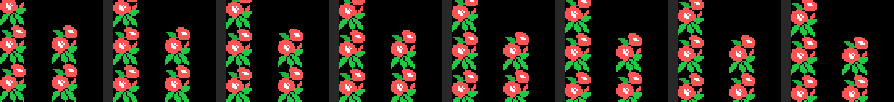
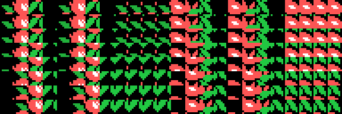

# El scroll al pixel de Pippols

Pippols (Konami, RC-729, 1985) mueve el fondo de pantalla **de pixel en pixel**
en un MSX1, en SCREEN 2, que es un modo que no tiene ni un registro de
desplazamiento. Este documento explica cómo está hecho, con las direcciones del
cartucho al lado y las cuentas medidas en el emulador.

Todo lo que sigue sale de leer el listado (`src/pippols.asm`) y de dos
comprobaciones independientes:

* `tools/graficos.py` **rehace en Python** lo que hace la ROM —las mismas tiras,
  el mismo generador de caracteres, la misma tabla de nombres— y dibuja la
  pantalla. Si el modelo estuviera mal, no saldría el juego.
* `tools/omsx_scroll.tcl` **mide en openMSX** cuánto cuesta, con el reloj del
  Z80 emulado (`work/omsx/scroll.log`).

---

## 1. El problema

En SCREEN 2 la pantalla son 24 x 32 **caracteres** de 8 x 8 pixeles. La tabla de
nombres dice qué carácter va en cada casilla, y la tabla de patrones dice cómo
es cada carácter. No hay desplazamiento por hardware, y hay tres complicaciones
más:

* La tabla de patrones está partida en **tres tercios** (filas 0-7, 8-15 y
  16-23) y cada tercio tiene sus propios 256 caracteres.
* Sólo hay **256 caracteres** por tercio.
* Mover los 256 patrones de un tercio cada fotograma serían 2048 bytes por el
  puerto del VDP: imposible a 50 fotogramas por segundo.

Así que el desplazamiento suave hay que fabricarlo.

## 2. La idea: el mismo dibujo ocho veces

Pippols mete en la VRAM **ocho copias de sus caracteres de fondo, cada una
bajada un pixel más que la anterior**:

    caracteres 0x40-0x57   el fondo sin bajar        (desplazamiento 0)
    caracteres 0x58-0x6F   el mismo, bajado 1 pixel  (desplazamiento 1)
    caracteres 0x70-0x87   ...bajado 2 pixeles
    ...
    caracteres 0xE8-0xFF   ...bajado 7 pixeles

Son **8 x 24 = 192 caracteres**, del 0x40 al 0xFF, o sea 1536 bytes de patrones
y otros 1536 de color, y ocupan exactamente lo que queda de tercio desde 0x2200
hasta 0x2800. Los 64 primeros caracteres (0x00-0x3F) se quedan para el marcador,
la fuente y el suelo.

Con eso, desplazar la pantalla un pixel es **sumarle 24 a todos los números de
carácter de la tabla de nombres**. Ni un patrón se toca.

Ésta es la misma ventana de fondo en los ocho desplazamientos, reconstruida por
`tools/graficos.py`:

Y los 192 caracteres de la fase 1 (cada fila es un desplazamiento):

## 3. Cómo se generan los 192 caracteres

Lo que hay comprimido en el cartucho son **cuatro tiras de 24 bytes**
(`0x5840` y siguientes), que son cuatro columnas de tres caracteres en
vertical. `CARGA_TIRAS` (0x571E) las trae a 0xEA00, y `CAMBIA_TINTAS` (0x577D)
les cambia tres parejas de tintas para que la misma forma salga de otro color
en cada pantalla del mundo.

`OCHO_DESPLAZAMIENTOS` (0x569E) es el generador: para cada desplazamiento `p`
de 0 a 7 llama dos veces a `DOCE_CARACTERES` (0x56B5), una por mitad. La mitad
izquierda sale de las tiras 1 y 2, y la derecha de las 3 y 4. Por eso al volcar
la tabla de nombres se escribe siempre **un carácter y el que está 12 más
allá**: son las dos columnas de la misma pareja.

Los 12 caracteres de cada mitad, llamando A a la tira de arriba y B a la de
abajo:

| índice | contenido |
|---|---|
| 0 | relleno arriba + los primeros 8-p bytes de A |
| 1, 2 | el resto de A, bajado p pixeles |
| 3 | el final de A + relleno abajo |
| 4-7 | lo mismo con la tira B |
| 8 | el final de A arriba, el principio de A abajo (**A repitiéndose**) |
| 9 | el final de A arriba, el principio de B abajo (**costura A-B**) |
| 10 | el final de B arriba, el principio de A abajo (**costura B-A**) |
| 11 | el final de B arriba, el principio de B abajo (**B repitiéndose**) |

Las cuatro últimas las monta `CARACTER_DE_COSTURA` (0x56ED), y **son la clave
de que esto funcione.** Un carácter bajado tres pixeles deja tres filas de
pixeles libres arriba, y ahí tiene que enseñarse *el final del carácter que hay
encima*. Como el fondo se monta repitiendo y alternando dos tiras, sólo hacen
falta cuatro combinaciones (A sobre A, A sobre B, B sobre A, B sobre B) y el
dibujo sale continuo en cualquiera de los ocho desplazamientos.

El relleno de los caracteres 0-7 es el byte **0x11**, que en la tabla de color
de SCREEN 2 significa *tinta 1 sobre fondo 1*: negro sobre negro. Da igual que
el patrón valga lo que valga; no se ve.

Los 192 caracteres se generan **una sola vez por pantalla**, en
`GENERA_FONDO` (0x566D), y se copian a los tres tercios iguales para que el
mismo número de carácter valga en cualquier fila.

## 4. La tabla de nombres, entera, cada fotograma

`VUELCA_NOMBRES` (0x5312) repinta **las 24 filas x 22 columnas** del área de
juego en cada fotograma. La columna 0 y de la 23 en adelante no se tocan: ahí
están el borde y el panel del marcador.

La fila no se guarda como 22 números de carácter, sino como **6 bytes** en un
buffer de RAM (0xE060-0xE0EF, 24 filas de 6). Cada byte describe cuatro
columnas, o sea dos parejas:

| byte del buffer | qué sale |
|---|---|
| menor que 0x0F | pareja fija (sin desplazamiento) + pareja vacía |
| 0x0F a 0x7F | pareja `n` desplazada + pareja vacía |
| 0x80 a 0xDF | la pareja `n-0x80` desplazada, **dos veces** |
| 0xE0 en adelante | una costura (8, 9, 10 u 11) y una tapa (0, 3, 4 o 7), elegidas por los tres bits de abajo |

El desplazamiento se aplica sumándole a cada número de carácter el valor que
calcula `FASE_DEL_SCROLL` (0x5306):

    L = 24 * (posicion_en_pixeles y 7)

y el bucle de salida escribe, por cada byte del buffer, `A`, `A+12`, `H` y
`H+12`. Al sexto byte sólo le caben dos columnas: 5 x 4 + 2 = 22.

Los caracteres por debajo del 0x0F **no llevan el desplazamiento sumado**: son
el fondo liso y los adornos fijos, que se ven igual en los ocho.

## 5. Y cada ocho pixeles, una fila

`PASO_DE_SCROLL` (0x5239) es el que lleva la cuenta. Cada fotograma:

1. suma (o resta) **un pixel** a la posición de la fase, que es un contador de
   16 bits en 0xE100;
2. guarda en 0xE11C la fase de 0 a 7;
3. si no se ha cruzado el borde de un carácter, llama directo a
   `VUELCA_NOMBRES` con el desplazamiento nuevo y ya está;
4. si se ha cruzado, **corre el buffer entero seis bytes** (un `lddr` de 138
   bytes) y `ARMA_FILA` (0x5293) construye la fila que entra.

En ese momento la fase vuelve a 0, así que el salto de fila y el desplazamiento
encajan sin costura.

## 6. De dónde sale la fila que entra

`ARMA_FILA` (0x5293) traduce una posición en pixeles a los 6 bytes de la fila,
con tres tablas encadenadas:

    posicion en pixeles
      |  DIVIDE (0x5653) entre 0xC0 = 192 pixeles = 24 filas
      +--> tramo (0..12)  y  fila dentro del tramo (0..23)
             |
             |  0x53A2: 10 fases x 13 tramos -> numero de plano
             +--> 0x5424: 19 planos x 6 piezas
                    +--> 0xE500: 44 piezas de 24 filas, un byte por fila

O sea: una fase son **trece tramos de 24 filas** = 2496 pixeles, y cada tramo
es una fila de **seis piezas** puestas una al lado de otra, cada una de cuatro
columnas de ancho. La primera y la última suelen ser la pieza 2, que es el
borde del camino.

Las 44 piezas no están en el cartucho tal cual: `DESCOMPRIME_PIEZAS` (0x5496)
las monta en 0xE500 pegando 352 grupos de tres filas sacados de un diccionario
de 25 entradas (0x54C0), con la lista de índices en 0x550B. Ocho índices por
pieza.

> Un detalle: la lista de índices tiene 328 bytes y el bucle lee 352. Las 24
> últimas lecturas caen ya dentro del **código** de 0x5653, así que las piezas
> 41, 42 y 43 salen de basura. Ninguna tabla apunta a ellas.

Al empezar una pantalla, `ARMA_PANTALLA` (0x5384) hace esto mismo 24 veces
seguidas, de abajo arriba, para llenar el buffer entero.

## 7. Lo que cuesta

Medido en openMSX sobre un **Philips VG-8020** (PAL, Z80 a 3.579545 MHz, o sea
71591 ciclos por fotograma), dejando correr la demo 150 segundos emulados:
1112 fotogramas de juego, `work/omsx/scroll.log`.

| | ciclos | % del fotograma |
|---|---|---|
| `VUELCA_NOMBRES`, media | 32557 | 45.5 % |
| `VUELCA_NOMBRES`, máximo | 33969 | 47.4 % |
| La interrupción entera, media | 52533 | 73.4 % |
| La interrupción entera, máximo | 70080 | 97.9 % |

Reparto de los 1112 fotogramas de juego:

    60- 70 % :   146
    70- 80 % :   853
    80- 90 % :   112
    90-100 % :     1

Y **732.7 escrituras al puerto de datos del VDP por fotograma**: 528 son la
tabla de nombres (24 x 22), unas 108 la tabla de sprites (27 sprites de cuatro
bytes, y los tres disparos enemigos sólo tres fotogramas de cada cuatro) y el
resto —hasta 128— los patrones del jugador, que se recargan enteros en cada
fotograma.

O sea: repintar la tabla de nombres se lleva **el 62 % del tiempo de la
interrupción**, y la interrupción se come tres cuartas partes del fotograma.
El programa principal no hace nada —se queda en `jr $` en 0x4074— porque no le
sobra tiempo para nada.

## 8. Por qué así y no de otra manera

* **Mover los patrones** (rodar los 8 bytes de cada carácter) costaría 1536
  bytes por fotograma sólo para el fondo, y además hay que hacerlo en los tres
  tercios: 4608. Es más del doble de lo que cuesta repintar los nombres, y
  encima habría que leer de la VRAM o llevar una copia en RAM.
* **Rodar la tabla de nombres** (dejar los caracteres quietos y mover la
  ventana) no vale en SCREEN 2: al pasar una fila de un tercio a otro, el mismo
  número de carácter cambia de dibujo. Pippols lo esquiva cargando los tres
  tercios iguales, pero aun así seguiría moviéndose de ocho en ocho pixeles, no
  de uno en uno.
* **El precio** de la solución elegida son los 192 caracteres: tres cuartas
  partes del juego de caracteres se van en el fondo. Por eso el marcador está
  en un panel a la derecha con su propia fuente de 42 caracteres, y por eso el
  fondo sólo tiene doce parejas distintas.

## 9. Lo que no se puede afirmar

* Las medidas son de la **demo**, que juega sola y no llena la pantalla de
  enemigos. Con diez enemigos y dos disparos en marcha el fotograma dará más.
* El único fotograma que pasó del 90 % en la muestra no se ha aislado: no se
  sabe si es un cambio de pantalla o una punta normal.
