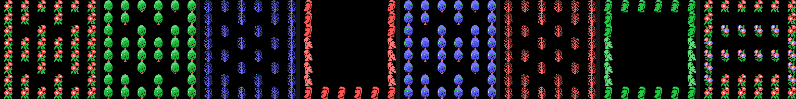

# Findings

What turns up on taking it apart and cannot be seen by playing. Each item with
its address; whatever was measured, with the measurement.

## The background is in video memory eight times over

SCREEN 2 has no scroll register, so Pippols builds one: VRAM holds **192
characters** (0x40 to 0xFF) that are eight copies of the same set of 24, each one
a pixel lower. Scrolling the screen by a pixel means adding 24 to the character
number and writing the name table again; not one pattern is touched.

Those 192 are generated **in RAM at the start of each screen** (0x566D) out of
four 24-byte strips, and of the twelve characters in each half **four are
seams**: the end of one strip on top and the beginning of another underneath.
Without them the drawing would split halfway down as soon as the offset was not
zero. The whole thing is in [The pixel scroll](THE-PIXEL-SCROLL.html).

## The game's entire map fits in 328 bytes

A stage is thirteen stretches of 24 rows; a stretch, six pieces of four columns;
and the 44 pieces are built in RAM by gluing groups of three rows from a
dictionary of 25. The index list —eight per piece— is **328 bytes**, and that
describes the whole road of all ten plans.

## The map decompressor runs into the code, and pieces are left over

The loop at 0x5496 builds 44 pieces, that is 352 reads, but the index list is
only 328 bytes long. The last 24 reads land inside the **code** at 0x5653, which
is the division routine, and out of that come three junk pieces: 41, 42 and 43.
It does not matter, because no stretch points at them.

The odd part is that nobody points at pieces **0 and 1** either, and those are
properly built. Of the 44 that get constructed, the game uses 39.

## The score lies by a factor of ten

The score is three BCD bytes, but the panel paints the six digits and then a
**fixed zero** behind them. What you see is ten times the counter, which is why
every score ends in zero. Picking something up is worth 100, 500, 1000 or 2000 of
the points you see; the boot and the shield, 5000; the goal and the throne, 3000.
The first extra life comes at 20,000 and then every 60,000.

## The boot and the shield are the same drawing

In the table at 0x785A each object carries its (pattern, colour) pair. Object 8
—the boot, which makes you walk one and a half times faster— and object 9 —the
shield— carry **the same pattern, 0xC0**, and differ only in colour: 9 for one, 5
for the other. Objects 1 and 4 do the same with pattern 0xA4.

## A jump that lands inside another instruction

At 0x717D there is a `jr nz,$+4` that ends up at 0x7181, and 0x7181 is not the
start of anything: it is the displacement byte of the `jr z` on the line above.
It executes as `dec b`, which does not matter there because the creature loop
keeps BC on the stack (`push bc` at 0x6B2C, `pop bc` at 0x6B41), and carries on
into the `ld c,002h` at 0x7182. It is the only place in the cartridge where an
instruction is entered halfway through.

## The sprites take turns in the order

The MSX can only show four sprites on a line; the fifth disappears. Pippols
spreads the loss around: the routine that builds the table (0x7F83) writes the
creatures first and the objects second on one frame, and the other way round on
the next. So what gets dropped keeps changing instead of always being the same
thing.

## Eighteen screens and five drawings

The 18 world screens share the background drawings: there are eight stages but
only five sets of strips, and what changes from one screen to another is a **swap
of three pairs of inks** (0x577D) over the 96 colour bytes. The same flower comes
out red or pink, the same tree green or blue.

Nor is the route a row of screens: the table at 0x7B62 gives **two destinations
for each** and one or the other is taken depending on whether you are going up or
down, so two different games do not see the same screens.

## The three thirds of the screen, loaded the same

In SCREEN 2 each third of the screen has its own 256 patterns. Pippols loads all
three with the same thing, byte for byte, and only because of that can it run the
background rows from top to bottom without a character changing its drawing as it
crosses row 8 or row 16. It is three times the memory in exchange for a character
number always meaning the same thing.

## What the scroll costs, measured

In openMSX, on a Philips VG-8020 (PAL, 71,591 cycles per frame) and over 1112
frames of the demo:

| | cycles | % of the frame |
|---|---|---|
| dumping the name table, average | 32,557 | 45.5 % |
| dumping the name table, peak | 33,969 | 47.4 % |
| the whole interrupt, average | 52,533 | 73.4 % |
| the whole interrupt, peak | 70,080 | 97.9 % |

And 732.7 writes to the VDP data port per frame. Repainting the name table takes
62 % of the interrupt's time, and the interrupt eats three quarters of the frame:
that is why the main program is a `jr $`.

## An address that gets written and nobody reads

0xE126 is written at 0x59EF on every step of the player, and in the cartridge's
16,384 bytes there is not one instruction that reads it.

## THE HOLLY GEM

The text that comes up on reaching the throne is at 0x7C5C, in characters from
the cartridge's own font: BRING BACK / THE HOLLY GEM / THE WORLD IS / WAITING FOR
YOU. With two Ls, just like that.
