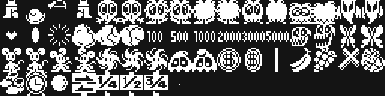

# The cartridge

## The header and the machine

The first sixteen bytes are the header the BIOS reads:

```
4000  41 42        "AB", a cartridge's signature
4002  4A 40        INIT = 0x404A
4004  00 00 00 00 00 00   STATEMENT, DEVICE and TEXT set to zero
400A  00 x6        padding
```

With the header at 0x4000 the BIOS maps the cartridge into **page 1**
(0x4000-0x7FFF) and jumps to INIT once it has finished booting. From there the
program never comes back: INIT writes `jp 0x4010` into the H.KEYI hook (0xFD9A)
and drops into a two-byte `jr $` at 0x4074. The whole game runs inside the
interrupt, one step per frame.

RAM is used from 0xE000 up, with the stack at 0xF000, so a 16 KB MSX is enough.

## Video memory

SCREEN 2, with the eight registers at 0x43FD:

| register | value | what it says |
|---|---|---|
| R0 | 0x02 | graphics mode 2 |
| R1 | 0xE2 | 16 K, screen and interrupt on, 16 × 16 sprites |
| R2 | 0x0E | name table at 0x3800 |
| R3 | 0x7F | colour table at 0x0000 |
| R4 | 0x07 | pattern table at 0x2000 |
| R5 | 0x76 | sprite attributes at 0x3B00 |
| R6 | 0x03 | sprite patterns at 0x1800 |
| R7 | 0xE4 | ink 14 on background 4 |

In SCREEN 2 the screen is split into **three thirds** of eight rows, and each
third has its own 256 patterns. Pippols loads all three the **same**, so a
character number means the same thing whatever row it is on; without that, the
background would break as it crossed row 8 or row 16.

The 256 characters are shared out like this:

| characters | what they are |
|---|---|
| 0x00-0x0F | plain background and fixed decorations (0x00 and 0x0C are the empty pair) |
| 0x09-0x0A | the ground, which changes on every screen |
| 0x10-0x39 | the font: ten digits and twenty-six letters |
| 0x40-0xFF | **the 192 of the scrolling background** |

Those 192 are the point of the whole cartridge: eight copies of the same set of
24 characters, each one a pixel lower. They are explained in [The pixel
scroll](THE-PIXEL-SCROLL.html).

What goes to VRAM is compressed with a three-order RLE (0x43AE): a command byte,
and if it is 0 it ends, if bit 7 is clear it repeats the next byte that many
times, and if it is set it copies that many bytes as they are. 0x80 starts
another block with a new address. The font, for example, takes 264 bytes in the
cartridge and 336 in VRAM; the KONAMI logo patterns, 151 and 216.

## The sprites

The 52 common patterns are decompressed in one go into 0x1880 (0x5E67), and the
player's are loaded separately: there are **26 blocks** in the table at 0x643A,
and each frame whichever one matches the current sprite set —walking, sitting on
the throne, dying— is sent up to 0x1800. That is how the little fellow is
animated without burning spare patterns.

The attribute table holds 32 sprites: the boss, four for the player, ten
creatures, seven objects, two of your shots and three of theirs. The order they
are written in **alternates from one frame to the next** (0x7F83), creatures
first on one frame and objects first on the next, so that the MSX's limit of four
sprites per line does not always hide the same ones.



## The RAM map

| address | what it holds |
|---|---|
| 0xE000/0xE001 | the program's state and substate |
| 0xE005 | the interrupt's lock |
| 0xE010-0xE039 | the three sound channels, 14 bytes each |
| 0xE043-0xE048 | high score and score, three BCD bytes each |
| 0xE050 | lives |
| 0xE060-0xE0EF | the name table buffer: 24 rows of 6 bytes |
| 0xE100/0xE101 | the position within the stage, in pixels |
| 0xE103 | the background stage (0-7) |
| 0xE11C | the offset of 0 to 7 pixels within the character |
| 0xE120-0xE126 | the player: state, direction, animation, Y, X and sprite set |
| 0xE132 | which world screen you are on (0-17) |
| 0xE1B0-0xE1C7 | three enemy shots of 8 bytes |
| 0xE1E0-0xE1EF | the player's two shots |
| 0xE200-0xE29F | the ten creatures, 16 bytes each |
| 0xE400-0xE42F | the seven objects, 6 bytes each |
| 0xE500-0xE91F | the 44 map pieces, 24 rows each |
| 0xEA00-0xEABF | the four background strips and their four colour strips |

A creature's slot is 16 bytes: type, substate, animation, counter, Y, X, pattern,
colour, the Y and X fractions, the Y and X velocities in 8.8 fixed point, and the
target. A negative type means it is dying.

## What it is made of

| | bytes | |
|---|---|---|
| code | 9099 | 55.5 % |
| data | 7285 | 44.5 % |
| unidentified | **0** | |

The data, from the inside: **1201** bytes are the music and effect tracks,
**1485** the compressed common sprite patterns and **883** the player's 26
blocks, **647** the whole map (the dictionary, the sequence, the stretches and
the plans), **409** the background strips with their colour, **408** the KONAMI
logo and the title, **358** the object lists of the six roads and **264** the
font. The rest are tables of a few dozen bytes each: which creatures each stage
gets, the sideways movement curves, the jump steps and the corners each creature
comes in through.

At the end of the cartridge there are 45 padding bytes of 0xFF and, behind them,
**nine bytes** nobody reads: they are in [Open
questions](OPEN-QUESTIONS.html).
