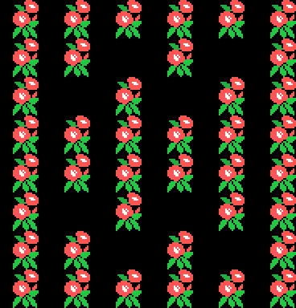

# El juego

Un enanito sube por un camino que no para de moverse, esquivando bichos,
recogiendo cosas y disparando, hasta llegar al trono. Todo lo que hay en esta
página sale de leer el código que lo hace.

## La pantalla

El área de juego son las columnas 0 a 22; la 23 en adelante es el panel de la
derecha, con HISCORE, SCORE, REST —las vidas—, el mapa del mundo con su punto
parpadeando y el ©KONAMI 1985 al pie. El fondo se mueve **de pixel en pixel**,
y el panel no se toca nunca porque el volcado de cada fotograma se para en la
columna 22.

Ojo con los puntos: el marcador pinta seis cifras y luego un **cero fijo**
pegado detrás, así que lo que se ve en pantalla es diez veces el contador
interno. Recoger algo da 100, 500, 1000 o 2000 puntos de los que se ven; matar
un bicho, entre 500 y 1000 según el tipo (la tabla de 0x751A).

## Moverse

El mando manda directamente sobre el estado del jugador (0xE120): 1 sube, 2
baja, 3 derecha, 4 izquierda, 0 quieto. Subir y bajar mueven un pixel por paso
—uno y medio con la bota— y los topes son la fila 15 por arriba y la 0xAA por
abajo. A los lados el recorrido va de X = 0x0A a X = 0xAB.

Lo lateral no es un simple paso: hay **tres curvas de 32 desplazamientos**
(0x5AD4, 0x5AF4 y 0x5B14), una para cuando la pantalla sube, otra para cuando
baja y otra para cuando el fondo está parado. Andar de lado recorre la curva
que toque, y en el paso 0x20 suena la pisada.

Delante del jugador se mira siempre el fondo (0x5B6A): se lee el carácter que
hay en la tabla de nombres en cuatro sondas alrededor, y como los caracteres
del fondo cambian de número con el desplazamiento, la comparación se hace
contra `0x40 + 24 × fase`, que es donde empieza el bloque que se está usando en
ese momento. Ahí está la diferencia entre camino y decorado.

## Disparar

Con el botón salen hasta **dos disparos a la vez**, cada uno con su ficha de 8
bytes en 0xE1E0. Van hacia arriba o hacia abajo según 0xE121 —el último sentido
vertical que se pulsó—, a cuatro pixeles por fotograma, con el patrón de sprite
0x40 en blanco. Se apagan al agotar su contador o al salirse del margen de
0xC0 a 0xFA.

Los bichos también disparan: hay tres disparos enemigos (0xE1B0, 8 bytes cada
uno), que salen apuntando al jugador y se paran al tocar el fondo.

## Los bichos

Diez fichas de 16 bytes en 0xE200, y **doce tipos**. Cada tipo es una rutina de
la tabla de 0x6B58, más otra que lo remata al soltarlo (0x6861) y otra que
decide por dónde entra (0x68B4). Lo que hace cada uno:

| tipo | comportamiento |
|---|---|
| 1 | persigue al jugador y mira el fondo por delante |
| 2 | va y viene por la pantalla |
| 3 | se mueve en línea recta y rebota |
| 4 | da saltos, apuntando al jugador |
| 5 | se queda quieto parpadeando y luego sale disparado |
| 6 | se queda parado en el sitio |
| 7 | baja hasta la fila 0x60 y allí se queda |
| 8 | igual, con otro fotograma |
| 9 | persigue y se muere al llegar a la fila 0xD0 |
| 10 | da vueltas alrededor del jugador |
| 11 | planea cambiando de rumbo al azar |
| 12 | el grandote que sale en la pantalla del trono |

La persecución no es un giro seco: el motor de 0x6B72 **acerca poco a poco** la
velocidad del bicho a la que le llevaría hasta el jugador, en coma fija de 8.8,
y la escala de velocidades (0x6A8A) va del 0x0C al 0x1E según la dificultad,
que sube con cada pantalla hasta 0x20.

Quién sale y cuándo lo dicen dos tablas: la de 0x730E, que da el tipo que suelta
el goteo continuo de cada fase (siempre el 10 o el 11), y la de 0x73AE, con
veinte bytes por fase —diez parejas (tipo, cuántos)— que se van encargando
según por qué tramo del camino vas. Los tipos por debajo del 10 salen cada 32
fotogramas y los demás cada 16; el 12 sale en cuanto se le encarga. Y mientras
suene la música de morir, la de la meta o la del final, no sale ninguno.

Un bicho puede morirse antes de nacer: si la casilla donde le toca aparecer
está pintada, se descarta (0x699C).

## Lo que se recoge

Ocho fichas de 6 bytes en 0xE400, y el choque es un cuadrado de 24 × 24
alrededor del jugador. Los objetos van pegados al scroll, parpadean mientras
no se han cogido, y los que llevan rótulo de puntos suben solos hasta
apagarse.

Trece tipos, y cuatro hacen algo más que sumar:

- **el 6** es la meta: mata a todos los bichos de la pantalla y arranca el final
  de la fase (3000 puntos);
- **el 7** sienta al jugador en el trono (3000 puntos);
- **el 8** es la bota: se anda una vez y media más rápido (5000 puntos);
- **el 9** es el escudo: 5000 puntos y, mientras dura, la casilla que se mira a
  la derecha pasa de dos columnas a cuatro.

Los demás se acumulan **por clases**: al cuarto igual, premio gordo. La lista de
cada fase (0x7888 y siguientes) son parejas (posición, tipo), y se consulta cada
16 pixeles de scroll para ver si toca soltar algo. En las fases 1 y 3 hay además
objetos del tipo 5 que se rompen a pisotones.

## El mundo

Dieciocho pantallas, en dos mitades de nueve. El recorrido no es una fila: la
tabla de 0x7B62 da **dos destinos por pantalla**, y cuál de los dos se toma
depende de si se va subiendo o bajando. En la mitad de arriba:

| desde | subiendo | bajando |
|---|---|---|
| 0 | 1 | 2 |
| 1 | 4 | 2 |
| 2 | 5 | 3 |
| 3 | 1 | 4 |
| 4 | 5 | 6 |
| 5 | 6 | 3 |
| 6 | 7 | 8 |
| 7 | 5 | 3 |

La 8 es el trono. Al llegar sale el letrero —BRING BACK / THE HOLLY GEM / THE
WORLD IS / WAITING FOR YOU— y el mapa del mundo se da la vuelta: se empieza la
mitad de abajo por la pantalla 9, y las nueve de abajo llevan al mismo sitio,
que es la 17, la pantalla final.

Cada pantalla tiene su fase de fondo (0x7B84), su cambio de tinta (0x57D6) y su
suelo (0x4520), y son ocho fases pero cinco juegos de dibujos, así que muchas
pantallas comparten forma y sólo cambian de color:

## La demo

Sin tocar nada, la demo va pasando por las nueve pantallas de la mitad de
arriba, una detrás de otra, con la X de salida sorteada con el registro R. El
mando es de mentira: dieciséis pasos en 0x5229, uno cada 32 fotogramas, metidos
en 0xE009 como si viniesen del joystick.
